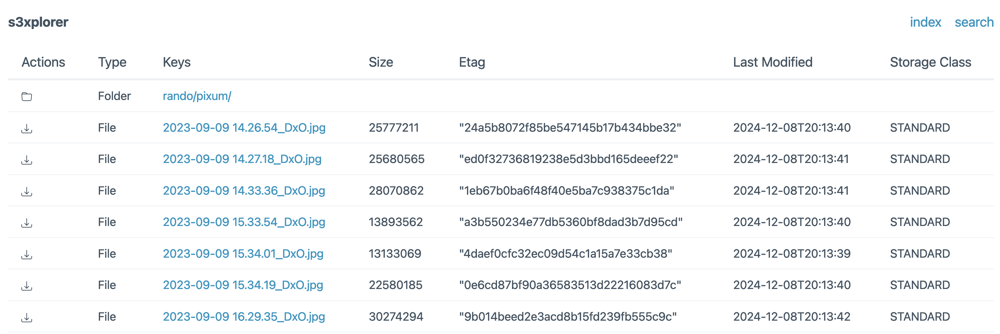

# s3xplorer

[](https://github.com/sgaunet/s3xplorer/releases/latest)
[](https://goreportcard.com/report/github.com/sgaunet/s3xplorer)

[](LICENSE)

s3xplorer is a web interface to parse a S3 bucket.

In the beginning, this project was a POC to play with AWS golang SDK v2 and the minio library. It's quite basic, it still needs refactor and improvements...



## Install

* Use the binary in the release page
* Or the Docker image
* Or [helm chart](https://github.com/sgaunet/helm-s3xplorer)

Check next section to see how to configure it.

### Docker

```yml
version: '3.7'
services:
  minio-server:
    image: minio/minio:RELEASE.2024-11-07T00-52-20Z-cpuv1
    ports:
      - 9090:9000
      - 8080:8080
    environment: 
      - MINIO_ROOT_USER=minioadminn
      - MINIO_ROOT_PASSWORD=minioadminn
    volumes:
      - ./data:/export
    command: minio server /export --console-address 0.0.0.0:8080

  s3xplorer:
    image: sgaunet/s3xplorer:<version>
    ports:
      - 8081:8081
    volumes:
      - ./config.yaml:/cfg.yaml
    depends_on:
      - minio-server
```

### Helm

* Here is the [documentation of the helm chart](https://github.com/sgaunet/helm-s3xplorer/blob/main/charts/s3xplorer/README.md).
* Here is the source code of the [helm chart](https://github.com/sgaunet/helm-s3xplorer).

```bash
helm repo add s3xplorer https://sgaunet.github.io/helm-s3xplorer/
helm repo update
helm search repo s3xplorer
```

## Configuration

Example with a local minio server:

```yaml
# set s3endpoint and s3region if SSO is not used
s3endpoint: http://127.0.0.1:9090
s3region: "us-east-1"
# accesskey and apikey are mandatory if SSO is not used
accesskey: minioadminn
apikey: minioadminn
awsssoprofile: 
bucket: example
# set the prefix if you want to restrict the access to a specific folder
# don't forget to add the trailing slash at the end
prefix: rando/

# loglevel: debug | info | warn | error
loglevel: info
```

## Configuration with AWS SSO (not recommmended)

Example:

```yaml
s3endpoint:
s3region: "eu-west-3"
accesskey: 
apikey: 
ssoawsprofile: dev
bucket: my-bucket
prefix: ""

# loglevel: debug | info | warn | error
loglevel: info
```

To use AWS SSO, you need to have the AWS CLI installed and configured with the SSO profile.

```bash
aws sso login --profile <profile>
s3xplorer -f config.yaml
```

Then you can use the profile in the configuration file.
It's not recommended to use AWS SSO with this tool because the session will expire and you will need to re-authenticate.

## Usage

```bash
s3xplorer -f config.yaml
```

With Docker:

```bash
docker run -v $(pwd)/config.yaml:/config.yaml -p 8080:8080 sgaunet/s3xplorer:latest -f /config.yaml
# or
docker run -v $(pwd)/config.yaml:/cfg.yaml -p 8081:8081 sgaunet/s3xplorer:latest
```

## Development

This project is using :

* Golang
* [Task for development](https://taskfile.dev/#/)
* Docker
* [Docker buildx](https://github.com/docker/buildx)
* Docker manifest
* [Goreleaser](https://goreleaser.com/)

### Tasks

Launch task to see all available tasks:

```bash
task
```

## Performance

Quite lighweight now since 0.3.0. Tests with 3 concurrents downloads of 5GB of each file, and less thant 30MB memory consumption.
